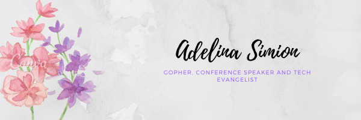
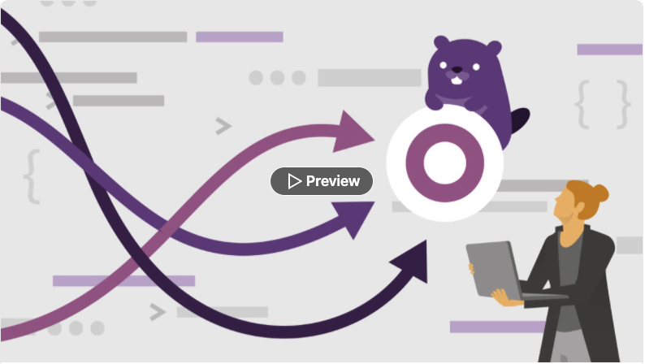
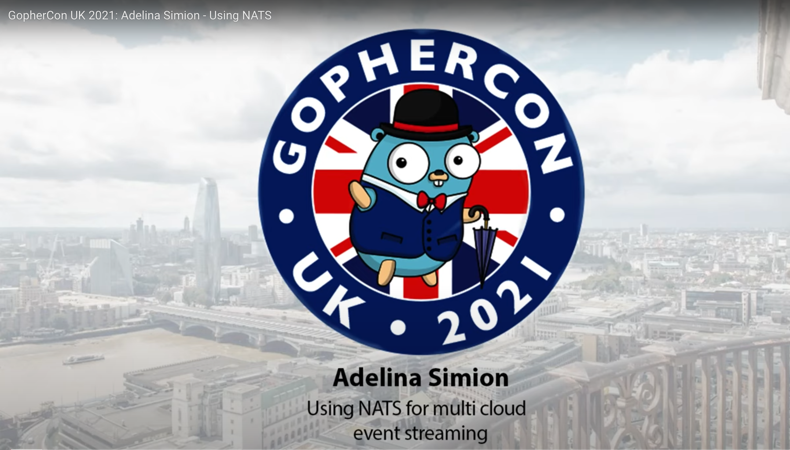

  

# Oh Hai! I'm Adelina 👋
 

I'm a Technology Evangelist 🥑  working at [Form3](https://www.form3.tech/), based in London. 🇬🇧 

I've been a Software Engineer since 2014, working at first in Java, then converted to Go in 2018.
You can read more about my background [on my blog](https://adelinasimion.dev/about_me/).

 

## My LinkedIn Learning course 🎓

I'm a [LinkedIn Learning instructor](https://www.linkedin.com/learning/instructors/adelina-simion). 👩🏻‍🏫

My course "Applied Concurrency in Go" was released in January 2022.

 

## Talks 🎤

You can see my full list of conference talks [on my blog](https://adelinasimion.dev/talks/).

One of my favourites is my talk "Using NATS for multi-cloud event streaming" at [Gophercon UK 2021](https://www.gophercon.co.uk/).

 

## Keep in touch with me! 💌
 

 

<h2>
Thanks for stopping by! ☀️
</h2>