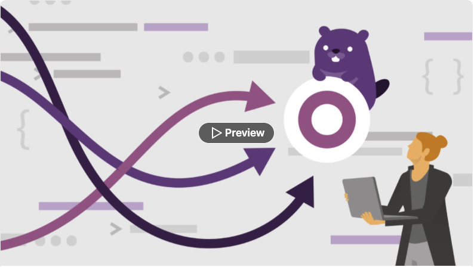
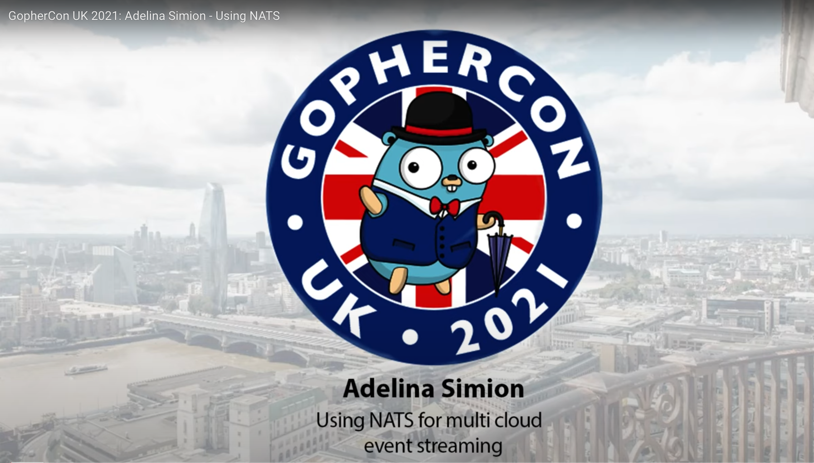

# Oh Hai! I'm Adelina Simion 👋
 

I'm a Technology Evangelist working at [Form3](https://www.form3.tech/) and based in London. 🇬🇧 

I've been a Software Engineer since 2014, working at first in Java and then converted to Go in 2018.
You can read more about my background [on my blog](https://adelinasimion.dev/about_me/)

 

## My LinkedIn Learning course 🎓

I'm a [LinkedIn Learning instructor](https://www.linkedin.com/learning/instructors/adelina-simion). 👩🏻‍🏫

My course "Applied Concurrency in Go" was released in January 2022.

 

## Talks 🎤

You can see my full list of conference talks [on my blog](https://adelinasimion.dev/talks/).

One of my favourites is my talk "Using NATS for multi-cloud event streaming" at [Gophercon UK 2021](https://www.gophercon.co.uk/).

 

## Keep in touch with me! 💌
 
<a href="https://twitter.com/classic_addetz" target="_blank">
    <svg xmlns="http://www.w3.org/2000/svg" width="48" height="48" viewBox="0 0 24 24"><path d="M0 0v24h24v-24h-24zm18.862 9.237c.208 4.617-3.235 9.765-9.33 9.765-1.854 0-3.579-.543-5.032-1.475 1.742.205 3.48-.278 4.86-1.359-1.437-.027-2.649-.976-3.066-2.28.515.098 1.021.069 1.482-.056-1.579-.317-2.668-1.739-2.633-3.26.442.246.949.394 1.486.411-1.461-.977-1.875-2.907-1.016-4.383 1.619 1.986 4.038 3.293 6.766 3.43-.479-2.053 1.079-4.03 3.198-4.03.944 0 1.797.398 2.396 1.037.748-.147 1.451-.42 2.085-.796-.245.767-.766 1.41-1.443 1.816.664-.08 1.297-.256 1.885-.517-.44.656-.997 1.234-1.638 1.697z" fill="#1DA1F2"/></svg>
</a>
<a href="https://www.linkedin.com/in/adelina-simion/" target="_blank">
    <svg xmlns="http://www.w3.org/2000/svg" width="48" height="48" viewBox="0 0 24 24"><path d="M19 0h-14c-2.761 0-5 2.239-5 5v14c0 2.761 2.239 5 5 5h14c2.762 0 5-2.239 5-5v-14c0-2.761-2.238-5-5-5zm-11 19h-3v-11h3v11zm-1.5-12.268c-.966 0-1.75-.79-1.75-1.764s.784-1.764 1.75-1.764 1.75.79 1.75 1.764-.783 1.764-1.75 1.764zm13.5 12.268h-3v-5.604c0-3.368-4-3.113-4 0v5.604h-3v-11h3v1.765c1.396-2.586 7-2.777 7 2.476v6.759z" fill="#0A66C2"/></svg>
</a>
<a href="hhttps://adelinasimion.dev/" target="_blank">
    <svg xmlns="http://www.w3.org/2000/svg" width="48" height="48" viewBox="0 0 24 24"><path d="M6.503 20.752c0 1.794-1.456 3.248-3.251 3.248-1.796 0-3.252-1.454-3.252-3.248 0-1.794 1.456-3.248 3.252-3.248 1.795.001 3.251 1.454 3.251 3.248zm-6.503-12.572v4.811c6.05.062 10.96 4.966 11.022 11.009h4.817c-.062-8.71-7.118-15.758-15.839-15.82zm0-3.368c10.58.046 19.152 8.594 19.183 19.188h4.817c-.03-13.231-10.755-23.954-24-24v4.812z" fill="#d80fac"/></svg>
</a>